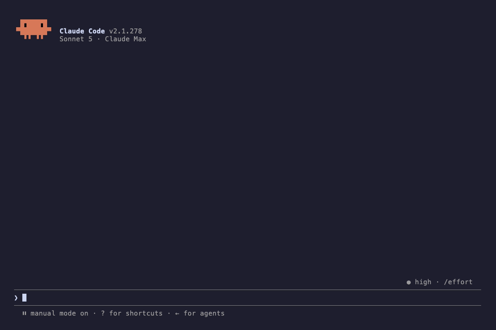

# paperless-ngx-mcp

[](https://github.com/cubinet-code/paperless-ngx-mcp/actions/workflows/ci.yml)
[](LICENSE)
[](https://www.npmjs.com/package/paperless-ngx-mcp)
[](https://www.npmjs.com/package/paperless-ngx-mcp)

A [Model Context Protocol](https://modelcontextprotocol.io/) server for [Paperless-NGX](https://docs.paperless-ngx.com/). Exposes the full Paperless-NGX REST API to AI assistants — documents, tags, correspondents, document types, custom fields, storage paths, saved views, share links and bundles, workflows, mail accounts and rules, document versions, notes, trash, and tasks.



## Why this one?

- **Complete, and it stays that way.** A CI test checks every endpoint in Paperless's `/api/schema/` against the tools here and fails when upstream adds one that is neither wrapped nor deliberately skipped.
- **Tested against real Paperless.** The end-to-end suite runs the tools against a live Paperless-ngx 3.2.1 container, not mocks.
- **Asks before it breaks things.** Every `delete_*` tool and `empty_trash` require `confirm: true`, and the [`triage_inbox`](#triage_inbox) prompt proposes changes and waits for your go-ahead before writing anything.
- **Easy to allowlist.** Verb-first tool names (`list_*`, `get_*`, `delete_*`, …) group into [one permission wildcard each](#tool-naming-convention-for-permission-allowlists).
- **Install it your way:** `npx`, a Docker image, a one-click Claude Desktop extension, or the official MCP Registry.

## Compatibility

Targets **Paperless-ngx 3.2** (tested against 3.2.1). Older Paperless versions are not supported — use `paperless-ngx-mcp@3.1.1` for Paperless 2.x. The package major version tracks the Paperless-ngx major it targets; there are no `1.x` or `2.x` releases.

## Quick Start

The server is published to npm as [`paperless-ngx-mcp`](https://www.npmjs.com/package/paperless-ngx-mcp). You can run it with `npx` — no clone or build required.

### Claude Code

```bash
claude mcp add paperless --scope user \
  --env PAPERLESS_URL=https://your-paperless-instance \
  --env PAPERLESS_API_KEY=your-api-token \
  -- npx -y paperless-ngx-mcp
```

Drop `--scope user` to install for the current project only. See `claude mcp add --help` for more options.

### Codex CLI

```bash
codex mcp add paperless \
  --env PAPERLESS_URL=https://your-paperless-instance \
  --env PAPERLESS_API_KEY=your-api-token \
  -- npx -y paperless-ngx-mcp
```

This writes the entry to `~/.codex/config.toml`.

### Claude Desktop (extension)

Download [`paperless-ngx-mcp.mcpb`](https://github.com/cubinet-code/paperless-ngx-mcp/releases/latest/download/paperless-ngx-mcp.mcpb) from the latest release and double-click it, or install it from **Settings → Extensions**. Claude Desktop asks for your Paperless URL and API token.

### Claude Desktop, Cursor, Cline, and other MCP clients

[](https://cursor.com/en/install-mcp?name=paperless&config=eyJjb21tYW5kIjoibnB4IiwiYXJncyI6WyIteSIsInBhcGVybGVzcy1uZ3gtbWNwIl0sImVudiI6eyJQQVBFUkxFU1NfVVJMIjoiaHR0cHM6Ly95b3VyLXBhcGVybGVzcy1pbnN0YW5jZSIsIlBBUEVSTEVTU19BUElfS0VZIjoieW91ci1hcGktdG9rZW4ifX0%3D)
[](https://insiders.vscode.dev/redirect/mcp/install?name=paperless&config=%7B%22command%22%3A%22npx%22%2C%22args%22%3A%5B%22-y%22%2C%22paperless-ngx-mcp%22%5D%2C%22env%22%3A%7B%22PAPERLESS_URL%22%3A%22https%3A%2F%2Fyour-paperless-instance%22%2C%22PAPERLESS_API_KEY%22%3A%22your-api-token%22%7D%7D)

The buttons install placeholder values; replace `PAPERLESS_URL` and `PAPERLESS_API_KEY` afterwards. Or add this to your client's MCP config file (e.g. `claude_desktop_config.json`, `~/.cursor/mcp.json`, `~/.config/cline/mcp.json`):

```json
{
  "mcpServers": {
    "paperless": {
      "command": "npx",
      "args": ["-y", "paperless-ngx-mcp"],
      "env": {
        "PAPERLESS_URL": "https://your-paperless-instance",
        "PAPERLESS_API_KEY": "your-api-token",
        "PAPERLESS_PUBLIC_URL": "https://your-public-domain"
      }
    }
  }
}
```

### Docker

A multi-arch image (amd64, arm64) is published to `ghcr.io/cubinet-code/paperless-ngx-mcp`. As a stdio server in any MCP client config:

```json
{
  "mcpServers": {
    "paperless": {
      "command": "docker",
      "args": ["run", "-i", "--rm", "-e", "PAPERLESS_URL", "-e", "PAPERLESS_API_KEY", "ghcr.io/cubinet-code/paperless-ngx-mcp"],
      "env": {
        "PAPERLESS_URL": "https://your-paperless-instance",
        "PAPERLESS_API_KEY": "your-api-token"
      }
    }
  }
}
```

Or as a long-running [Streamable HTTP](#http-streamable-http-transport) server. It has no authentication, so keep it off untrusted networks:

```bash
docker run -d -p 127.0.0.1:3000:3000 \
  -e PAPERLESS_URL=https://your-paperless-instance \
  -e PAPERLESS_API_KEY=your-api-token \
  ghcr.io/cubinet-code/paperless-ngx-mcp --http --port 3000
```

### Get your Paperless-NGX API token

1. Log into your Paperless-NGX instance.
2. Click your username (top right) → **My Profile**.
3. Click the circular arrow button to generate a new token.

### Configuration

| Variable | Required | Purpose |
|---|---|---|
| `PAPERLESS_URL` | yes | Base URL the MCP server uses to talk to Paperless-NGX. |
| `PAPERLESS_API_KEY` | yes | API token (see above). |
| `PAPERLESS_PUBLIC_URL` | no | Public URL the assistant uses when constructing browser links to documents. Falls back to `PAPERLESS_URL`. |

CLI flags (`--baseUrl`, `--token`, `--publicUrl`, `--http`, `--port`) take precedence over environment variables.

### Example Usage

Things you can ask Claude (or any MCP-aware assistant):

- "Show me all documents tagged as 'Invoice'"
- "Search for documents containing 'tax return'"
- "Create a new tag called 'Receipts' with color #FF0000"
- "Download document #123"
- "List all correspondents"
- "Create a new document type called 'Bank Statement'"
- "Empty the trash"
- "Show me pending consumption tasks"

## Available Tools

The server registers tools across twelve domains.

### Documents
`list_documents`, `get_document`, `get_document_content`, `search_documents`, `download_document`, `download_documents_bulk`, `get_document_thumbnail`, `get_document_preview`, `get_document_history`, `get_document_metadata`, `update_document`, `post_document`, `email_document`, `edit_documents_bulk`, `delete_document`, `search_autocomplete`, `get_document_suggestions`, `get_document_ai_suggestions`, `get_next_asn`, `upload_document_version`, `update_document_version`, `delete_document_version`, `merge_documents_as_versions`

### Tags
`list_tags`, `get_tag`, `create_tag`, `update_tag`, `delete_tag`, `edit_tags_bulk`

### Correspondents
`list_correspondents`, `get_correspondent`, `create_correspondent`, `update_correspondent`, `delete_correspondent`, `edit_correspondents_bulk`

### Document Types
`list_document_types`, `get_document_type`, `create_document_type`, `update_document_type`, `delete_document_type`, `edit_document_types_bulk`

### Custom Fields
`list_custom_fields`, `get_custom_field`, `create_custom_field`, `update_custom_field`, `delete_custom_field`, `edit_custom_fields_bulk`

### Storage Paths
`list_storage_paths`, `get_storage_path`, `create_storage_path`, `update_storage_path`, `delete_storage_path`, `test_storage_path`

### Saved Views
`list_saved_views`, `get_saved_view`, `create_saved_view`, `update_saved_view`, `delete_saved_view`

### Share Links
`list_share_links`, `list_document_share_links`, `get_share_link`, `create_share_link`, `delete_share_link`, `list_share_link_bundles`, `get_share_link_bundle`, `create_share_link_bundle`, `rebuild_share_link_bundle`, `delete_share_link_bundle`

### Workflows
`list_workflows`, `get_workflow`, `create_workflow`, `update_workflow`, `delete_workflow`, `list_workflow_actions`, `get_workflow_action`, `create_workflow_action`, `update_workflow_action`, `delete_workflow_action`, `list_workflow_triggers`, `get_workflow_trigger`, `create_workflow_trigger`, `update_workflow_trigger`, `delete_workflow_trigger`

### Mail
`list_mail_accounts`, `get_mail_account`, `create_mail_account`, `update_mail_account`, `delete_mail_account`, `test_mail_account`, `process_mail_account`, `list_mail_rules`, `get_mail_rule`, `create_mail_rule`, `update_mail_rule`, `delete_mail_rule`

### System / Notes / Trash / Tasks
`get_statistics`, `get_system_status`, `list_document_notes`, `create_document_note`, `delete_document_note`, `list_trash`, `restore_from_trash`, `empty_trash`, `list_tasks`, `list_active_tasks`, `get_task_status_counts`, `get_task_summary`, `acknowledge_tasks`

### Tool naming convention (for permission allowlists)

Tool names are **verb-first**, so wildcard-based permission rules group cleanly by operation:

| Wildcard | Covers |
|---|---|
| `mcp__paperless__list_*` | All list/index reads |
| `mcp__paperless__get_*` | All single-item reads |
| `mcp__paperless__search_*` | Full-text search and autocomplete |
| `mcp__paperless__download_*` | `download_document` and `download_documents_bulk` |
| `mcp__paperless__create_*` | All create endpoints |
| `mcp__paperless__update_*` | Per-item PATCH updates |
| `mcp__paperless__edit_*_bulk` | All bulk-edit operations across entity types |
| `mcp__paperless__delete_*` | ⚠️ Destructive — system-wide deletes |

A read-only allowlist is therefore: `list_*`, `get_*`, `search_*`, `download_*`. Write access without destructive operations: add `create_*`, `update_*`, `edit_*_bulk`, `post_document`, `email_document`. `delete_*` and `empty_trash` should require explicit user approval.

## Prompts

The server also registers MCP **prompts** — reusable, parameterized instructions that surface as slash commands in clients like Claude Code (e.g. `/mcp__paperless__triage_inbox`).

### `triage_inbox`

Walks the assistant through inbox triage: gather existing tags / correspondents / document types, propose metadata for each inbox document **preferring existing items**, present a confirmation table, and only apply changes after the user replies `apply`. New correspondents / types / tags are flagged `(NEW)` so you can veto creations before they happen.

Argument:
- `limit` (optional, default `25`): maximum number of inbox documents to triage in one pass.

### Notable tool details

#### `edit_documents_bulk`

Perform bulk operations on multiple documents.

Parameters:
- Selection: `documents` (array of IDs), **or** `all: true` + `filters` (list_documents wire filters, e.g. `{ correspondent__id: 12 }`) with optional `excluded_documents`
- `method`: one of `set_correspondent`, `set_document_type`, `set_storage_path`, `add_tag`, `remove_tag`, `modify_tags`, `modify_custom_fields`, `delete`, `reprocess`, `set_permissions`, `merge`, `split`, `rotate`, `delete_pages`, `edit_pdf`, `remove_password`
- Method-specific parameters: `correspondent`, `document_type`, `storage_path`, `tag`, `add_tags`, `remove_tags`, `add_custom_fields`, `remove_custom_fields`, `set_permissions`, `owner`, `merge`, `metadata_document_id`, `delete_originals`, `pages`, `degrees`, `operations`, `update_document`, `include_metadata`, `password`, `delete_original`, `remote_ocr`

```typescript
// Add a tag to multiple documents
edit_documents_bulk({ documents: [1, 2, 3], method: "add_tag", tag: 5 })

// Merge documents
edit_documents_bulk({
  documents: [6, 7, 8],
  method: "merge",
  metadata_document_id: 6,
  delete_originals: true,
})

// Split a document into parts
edit_documents_bulk({ documents: [9], method: "split", pages: "[1-2,3-4,5]" })

// Modify multiple tags at once
edit_documents_bulk({
  documents: [10, 11],
  method: "modify_tags",
  add_tags: [1, 2],
  remove_tags: [3, 4],
})

// Move every document from a duplicate correspondent (12) to the canonical one (34)
edit_documents_bulk({ all: true, filters: { correspondent__id: 12 }, method: "set_correspondent", correspondent: 34 })

// Unlock a password-protected PDF, keeping the result as a new version
edit_documents_bulk({ documents: [55], method: "remove_password", password: "…", update_document: true })
```

#### `post_document`

Upload a new document.

Parameters: `file`, `filename`, plus optional `title`, `created`, `correspondent`, `document_type`, `storage_path`, `tags`, `archive_serial_number`, `custom_fields`, `poll`, `poll_timeout_seconds`.

`file` accepts **base64-encoded contents** (the universal method — works for any deployment, since the bytes travel over the wire) or an **absolute file path** that the server reads from its own filesystem. The path option only works when the MCP server runs on the same machine as the file (local/stdio deployments); for a remote server, use base64.

Upload is asynchronous. By default the tool returns a task UUID (track it with `list_tasks`). Set `poll: true` to wait for the consumer to finish and get the result in one call — the new `document_id` on success, or the consumer error on failure. `poll_timeout_seconds` (default 30, max 300) caps the wait; raise it for large scans where OCR is slow.

#### Matching algorithms

`create_tag`, `create_correspondent`, `create_document_type`, and `create_storage_path` accept a `matching_algorithm` (0–6):

| Value | Meaning |
|---|---|
| 0 | None |
| 1 | Any word |
| 2 | All words |
| 3 | Exact match |
| 4 | Regular expression |
| 5 | Fuzzy word |
| 6 | Automatic |

## Running the MCP Server

### stdio (default)

The default mode. The server communicates over stdio — that's what every MCP client config in the Quick Start uses. You usually never run this manually; the MCP client launches it for you.

If you do want to run it directly (e.g. for debugging):

```bash
# via env vars (recommended)
PAPERLESS_URL=http://localhost:8000 PAPERLESS_API_KEY=xxx npx -y paperless-ngx-mcp

# or via CLI flags
npx -y paperless-ngx-mcp --baseUrl http://localhost:8000 --token xxx
```

### HTTP (Streamable HTTP transport)

Use the `--http` flag to expose the server over HTTP. `--port` defaults to `3000`.

```bash
npx -y paperless-ngx-mcp --baseUrl http://localhost:8000 --token xxx --http --port 3000
```

- The MCP API is available at `POST /mcp` on the chosen port, backed by [`StreamableHTTPServerTransport`](https://github.com/modelcontextprotocol/typescript-sdk) in **stateful** mode.
- The first request (an `initialize` call) creates a session and returns an `Mcp-Session-Id` header; subsequent requests must send that header back to reuse the same session. Transports are kept in an in-memory `Map`, so this only works for single-instance deployments.
- `GET /mcp` streams server-initiated messages for a session; `DELETE /mcp` terminates it and evicts it from the map. Both require a valid `Mcp-Session-Id` header.
- A legacy `GET /sse` + `POST /messages` SSE transport is also exposed for clients that don't yet support the streamable transport.

#### Session limits

Every session holds its own MCP server instance (~3.5 MB), and the HTTP port has **no authentication** — so sessions are bounded:

| Flag | Environment variable | Default | Purpose |
|---|---|---|---|
| `--maxSessions` | `PAPERLESS_MAX_SESSIONS` | `50` | Concurrent sessions allowed. Past this, `initialize` is refused with HTTP 503. |
| `--sessionIdleMinutes` | `PAPERLESS_SESSION_IDLE_MINUTES` | `30` | Evict a session after this long with no activity. |

A client that is actively connected — including one holding a `GET /mcp` stream open — is never evicted, no matter how long it stays idle. Only genuinely abandoned sessions are reclaimed.

Because sessions live in memory, `--http` only works for **single-instance** deployments. Do not expose the port to an untrusted network: there is no auth, and it binds all interfaces.

## Error Handling

Tool calls return clear errors when:
- `PAPERLESS_URL` or `PAPERLESS_API_KEY` is missing or wrong
- The Paperless-NGX server is unreachable
- The underlying API rejects the operation
- Tool parameters fail validation

## Development

You only need this section if you're modifying the server itself. End users should follow the [Quick Start](#quick-start) instead — there's no need to clone or build.

```bash
git clone https://github.com/cubinet-code/paperless-ngx-mcp.git
cd paperless-ngx-mcp
npm install        # install dependencies
npm run start      # run the server with tsx (no build step)
npm run build      # compile TypeScript to build/
npm test           # unit tests (node:test + tsx)
npm run inspect    # build, then launch @modelcontextprotocol/inspector
```

`npm run start` accepts the same flags / env vars as the built binary.

### End-to-end tests

E2E tests spin up a real Paperless-NGX container via Docker Compose:

```bash
npm run test:e2e:up    # start the test stack (paperless + redis)
npm run test:e2e       # run the e2e suite against it
npm run test:e2e:down  # tear down and remove volumes
```

Runs against `ghcr.io/paperless-ngx/paperless-ngx:3.2.1`.

Built with:
- [@modelcontextprotocol/sdk](https://github.com/modelcontextprotocol/typescript-sdk) — MCP server SDK
- [zod](https://github.com/colinhacks/zod) — schema validation
- [axios](https://github.com/axios/axios) — HTTP client (with keep-alive agents, a 60s idle timeout and a 90s per-request deadline)

## API Documentation

This MCP server wraps endpoints from the Paperless-NGX REST API. See the [official API documentation](https://docs.paperless-ngx.com/api/) for details on the underlying behaviour and field semantics.

## License

ISC. See [LICENSE](LICENSE).
